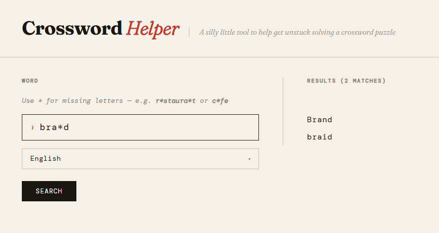

# Crossword Helper 

[](https://www.tinyurl.com/crosswordhelper)

## Try it out

* [English version](https://www.tinyurl.com/crosswordhelper)
* [Dutch version](https://www.tinyurl.com/kruiswoordhulpje)

## About 

I created this as an exercise to learn [Rust](https://rust-lang.org). The inspiration came from a bout of frustration trying to find the final missing words in last year's NRC Econogram. 

## Development

### Requirements 

Basic development: 

* [Rust](https://doc.rust-lang.org/cargo/getting-started/installation.html) 
* [Just](https://github.com/casey/just)

Cross-compilation to Raspberry Pi: 

```sh
sudo apt install gcc-aarch64-linux-gnu # Install cross-compilation linker
rustup target add aarch64-unknown-linux-gnu # Register as target for the rust compiler 
```

### Running

The logic can be accessed in two ways: 

* **As a CLI**: `just run "c*fe"`
* **As a web-service**: `just run-web`

For more commands, see the [justfile](./justfile).
